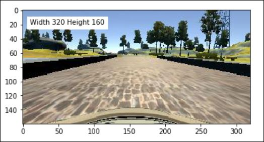
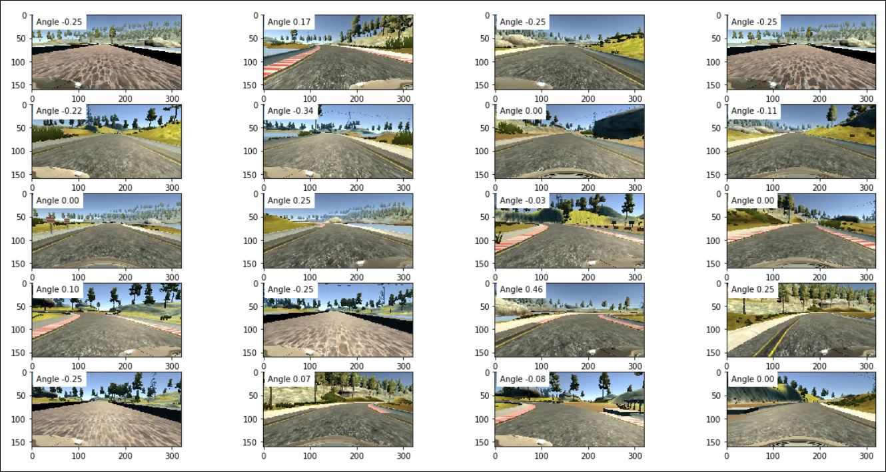
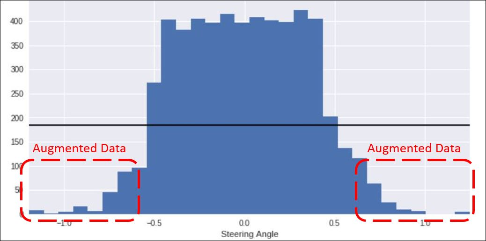

{
 "cells": [
  {
   "cell_type": "markdown",
   "metadata": {},
   "source": [
    "# **Behavioral Cloning** \n",
    "\n",
    "## Writeup Gaurav\n",
    "\n",
    "---\n",
    "#### 1. Submission includes all required files and can be used to run the simulator in autonomous mode\n",
    "\n",
    "My project includes the following files:\n",
    "* model.py containing the script to create and train the model\n",
    "* drive.py for driving the car in autonomous mode\n",
    "* model.h5 containing a trained convolution neural network \n",
    "* writeup_report.md or writeup_report.pdf summarizing the results\n",
    "* New_Gaurav_Model.ipynb jupyter notebook for the code contained in model.py\n",
    "\n",
    "#### 2. Submission includes functional code\n",
    "Using the Udacity provided simulator and my drive.py file, the car can be driven autonomously around the track by executing. Please click this link for my simulation [video](./images_video/run1.mp4)\n",
    "```\n",
    "python drive.py model.h5\n",
    "```\n",
    "\n",
    "#### 3. Submission code is usable and readable\n",
    "\n",
    "The model.py file contains the code for training and saving the convolution neural network. The file shows the pipeline I used for training and validating the model, and it contains comments to explain how the code works.\n",
    "\n",
    "* ```view_imgCV2(image)``` - Created to view the image (```model.py``` line 43-46)\n",
    "* ```pre_process(image)``` - Created to preprocess the image (apply gaussian blur and to crop the image). But after intial runs decided not to apply gaussian blur as the results were not good. Also decided to use keras ```Cropping2D``` to crop the images later as initial cropping in the ```pre_process(image)``` function gave error due to the input from ```drive.py``` was a complete full sized image (160x320) (```model.py``` line 51-56)\n",
    "* ```vizualize_images(images, angles)``` - Created to view random 20 images in a subplot (```model.py``` line 83-90)\n",
    "* ```plot_histogram(angles, n_bins)``` - Created to plot histogram (```model.py``` line 101-109)\n",
    "* ```delete_values(image_paths, angles)``` - Created to delete data from the bins containing more than twice the average number of samples per bin. Implementation source [Jeremy Shanon](https://github.com/jeremy-shannon/CarND-Behavioral-Cloning-Project) (```model.py``` line 116-139)\n",
    "* ```flip_images(image_paths, angles, flipped)``` - Created to augment the data having steering measurement more than 0.7 and less than -0.7 (```model.py``` line 151-168)\n",
    "* ```image_generator(image_paths, angles, flipped, batch_size=32)``` - Created to read in images from the data folder and generate the data (```model.py``` line 178-205)\n",
    "* ```X_train_paths, X_test_paths, y_train, y_test, flipped_train, flipped_test``` - Split the data into training and test data set for validation purpose using ```train_test_split(image_paths, angles, flipped, test_size=0.15)``` from ```sklearn.model_selection``` (```model.py``` line 173-176)\n",
    "* nVidia model (```model.py``` line 213-228)\n",
    "\n",
    "\n",
    "\n",
    "### Model Architecture and Training Strategy\n",
    "\n",
    "#### 1. An appropriate model architecture has been employed\n",
    "I have implemented [nVidia model](https://images.nvidia.com/content/tegra/automotive/images/2016/solutions/pdf/end-to-end-dl-using-px.pdf). \n",
    "\n",
    "nVidia Model - \n",
    "\n",
    "\n",
    "\n",
    "My Model summary -\n",
    "\n",
    "\n",
    "\n",
    "\n",
    "#### 2. Attempts to reduce overfitting in the model\n",
    "\n",
    "The model contains dropout layers in order to reduce overfitting. \n",
    "\n",
    "The model was trained and validated on different data sets to ensure that the model was not overfitting. The model was tested by running it through the simulator and ensuring that the vehicle could stay on the track.\n",
    "\n",
    "#### 3. Model parameter tuning\n",
    "\n",
    "The model used an adam optimizer, so the learning rate was not tuned manually.\n",
    "\n",
    "#### 4. Appropriate training data\n",
    "\n",
    "I used the sample data provided by udacity. I utilized the images from left and right cameras as well by using a correction factor of 0.25 to the steering angle measurement.\n",
    "\n",
    "Data Vizualization\n",
    "\n",
    "\n",
    "\n",
    "Plotting few random images with steering angles\n",
    "\n",
    "\n",
    "\n",
    "I plotted histogram to have a look at the spread of the data.\n",
    "\n",
    "\n",
    "\n",
    "As we can see we have more data for steering meansurement 0 and 0.25. It would be better for the model if we have more uniform data as shown by the black line. Hence to make it more uniform I deleted data from the bins containing more than average samples and kept the data having lesser than average. I implemented similar strategy as that of [Jeremy Shanon](https://github.com/jeremy-shannon/CarND-Behavioral-Cloning-Project).\n",
    "\n",
    "New histogram distribution is -\n",
    "\n",
    "\n",
    "\n",
    "The new distribution is better than the previos one which was more biased towards 0 and 0.25. Further I observed that there was very few data with measurements greater than + and - 0.7. Hence decided to fllp the images with measurments grater than 0.7 and less than -0.7. For that I created an array ```flipped``` to hold the tokens (0 - do not flip, 1- flip). Multiplied the measurements corresponding flipped images by -1.\n",
    "\n",
    "New histogram distribution after data augmentation is -\n",
    "\n",
    "\n",
    "\n",
    "### Model Architecture and Training Strategy\n",
    "\n",
    "#### 1. Solution Design Approach\n",
    "\n",
    "I implemented nVidia model as shown in the lecture notes nVidia model (```model.py``` line 213-228)\n",
    "```\n",
    "# Nvidia Architecture\n",
    "# image = mpimg.imread(str(image_paths[0]))\n",
    "row, col, ch = 90, 320, 3\n",
    "model = Sequential()\n",
    "```\n",
    "Normalized the images \n",
    "```\n",
    "model.add(Lambda(lambda x: (x/127.5) - 1, input_shape = (160, 320, 3))\n",
    "```\n",
    "Cropped the images to size 90x320x3 to eliminate the hood and the sky\n",
    "```\n",
    "model.add(Cropping2D(cropping = ((50,20), (0,0))))\n",
    "```\n",
    "24 layers of Convolution with 2x2 strides and 5x5 kernel size and relu activation function\n",
    "```\n",
    "model.add(Conv2D(24, (5,5), subsample = (2,2), activation = 'relu'))\n",
    "```\n",
    "36 layers of Convolution with 2x2 strides and 5x5 kernel size and relu activation function\n",
    "```\n",
    "model.add(Conv2D(36, (5,5), subsample = (2,2), activation = 'relu'))\n",
    "```\n",
    "48 layers of Convolution with 2x2 strides and 5x5 kernel size and relu activation function\n",
    "```\n",
    "model.add(Conv2D(48, (5,5), subsample = (2,2), activation = 'relu'))\n",
    "```\n",
    "64 layers of Convolution with 3x3 kernel size and relu activation function\n",
    "```\n",
    "model.add(Conv2D(64, (3,3), activation = 'relu')) \n",
    "```\n",
    "64 layers of Convolution with 3x3 kernel size and relu activation function\n",
    "```\n",
    "model.add(Conv2D(64, (3,3), activation = 'relu'))\n",
    "```\n",
    "64 layers of Convolution with 3x3 kernel size and relu activation function\n",
    "```\n",
    "model.add(Conv2D(64, (3,3), activation = 'relu'))\n",
    "```\n",
    "Dropout layer with with 0.5 as the fraction of inputs to drop\n",
    "```\n",
    "model.add(Dropout(0.5))\n",
    "```\n",
    "Flatten layer\n",
    "```\n",
    "model.add(Flatten())\n",
    "```\n",
    "Layers to reduce it to a single value output as the steering value is a single point value\n",
    "```\n",
    "model.add(Dense(100,activation = 'relu'))\n",
    "model.add(Dense(50,activation = 'relu'))\n",
    "model.add(Dense(10,activation = 'relu'))\n",
    "model.add(Dense(1))\n",
    "```\n",
    "\n",
    " I split my image and steering angle data into a training and validation set. \n",
    " ```X_train_paths, X_test_paths, y_train, y_test, flipped_train, flipped_test``` - Split the data into training and test data set for validation purpose using ```train_test_split(image_paths, angles, flipped, test_size=0.15)``` from ```sklearn.model_selection``` (```model.py``` line 173-176)\n",
    "\n",
    "The model contains dropout layers in order to reduce overfitting. \n",
    "\n",
    "The vehicle is able to drive autonomously around the track without leaving the road. \n",
    "\n",
    "[video](./images_video/run1.mp4)\n",
    "\n",
    "I ran the model for 10 Epochs and saved results from each epoch. Plotted the mean square error v/s epochs and saw that mean square error for training and validation set remained almost constant after 5 epochs hence used the result after epoch 5 to run the model and it successfully completed the first track. Mean square error for validation set is more than the training set indicating that the model is not overfitting.\n",
    "\n",
    "\n",
    "\n",
    "#### 2. Final Model Architecture\n",
    "\n",
    "Has already been discussed above.\n",
    "\n",
    "#### 3. Creation of the Training Set & Training Process\n",
    "\n",
    "Has already been discussed above.\n"
   ]
  }
 ],
 "metadata": {
  "kernelspec": {
   "display_name": "Python 3",
   "language": "python",
   "name": "python3"
  },
  "language_info": {
   "codemirror_mode": {
    "name": "ipython",
    "version": 3
   },
   "file_extension": ".py",
   "mimetype": "text/x-python",
   "name": "python",
   "nbconvert_exporter": "python",
   "pygments_lexer": "ipython3",
   "version": "3.6.6"
  }
 },
 "nbformat": 4,
 "nbformat_minor": 2
}
